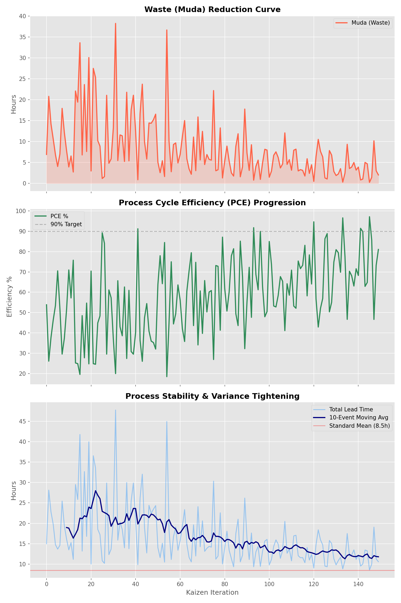

# 🛡️ Kaizen-Sigma Integrated Audit Report

**Generated:** 2026-02-13 16:09:21
**Overall Status:** ❌ **FAILED**

---

## 📊 Core Performance Metrics

| Metric | Measured Value | Threshold / Target | Status |
| :--- | :--- | :--- | :--- |
| **Six Sigma Cpk** | 1.0543 | >= 1.33 | ❌ |
| **Sigma Level** | 3.16 | 4.0+ | ✅ |
| **PCE % (Efficiency)** | 81.11% | 90.00% | ⚠️ |
| **Muda (Waste)** | 2.00h | < 5.0h | ✅ |

---

## 📈 Kaizen Visualization Dashboard

---

## 🔄 PDCA (Continuous Improvement) Analysis
- **Plan**: Current process varies with a Cpk of 1.0543.
- **Do**: Iterative waste reduction has brought Muda down to 2.00 hours.
- **Check**: Efficiency is at 81.11%.
- **Act**: Next cycle should focus on tightening variance to pass the 1.33 Cpk gate.

---
*Powered by Google Antigravity AI Auditor*
